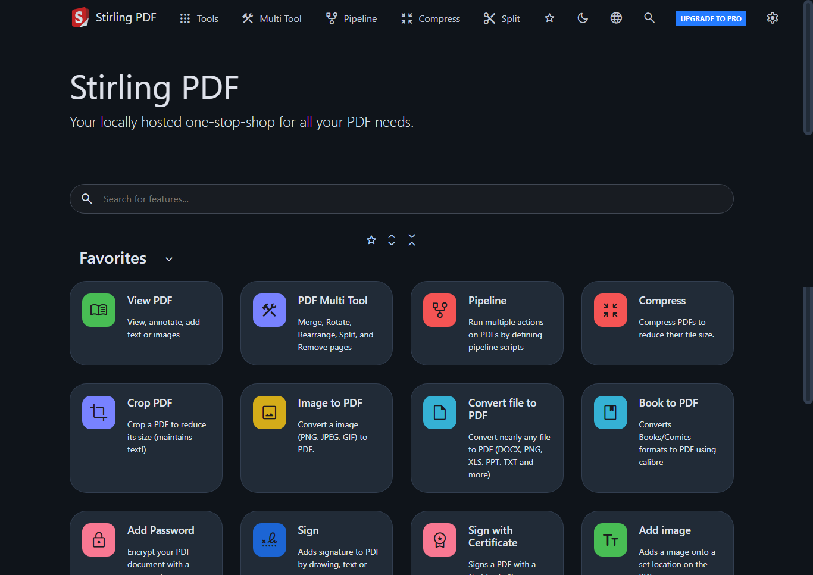

## 🐳 Docker Best Practices
Example of a high-performance, secure, and small-footprint Dockerfile using **Multi-Stage Builds**.

### 🛠️ The "Perfect" Dockerfile (Conceptual)
Using multi-stage builds allows us to use a heavy image for compiling/building and a very light one for production.

```dockerfile
# Stage 1: Build
FROM python:3.10-slim AS builder
WORKDIR /app
COPY requirements.txt .
RUN pip install --user --no-cache-dir -r requirements.txt

# Stage 2: Production (Final Image)
FROM python:3.10-slim
WORKDIR /app
# Copy only the installed packages from the builder stage
COPY --from=builder /root/.local /root/.local
COPY ./app .

ENV PATH=/root/.local/bin:$PATH
CMD ["python", "main.py"]
```

#🔧 Useful Docker Commands
Clean up unused images/volumes: docker system prune -a --volumes

Real-time resource stats: docker stats

Check IP address: docker inspect <id> | grep "IPAddress"

Check logs (last 100 lines): docker logs --tail 100 -f <container_name>


# 📄 Stirling-PDF: Alternativa Open-Source ao iLovePDF



Implementação do Stirling-PDF (versão `0.30.0` comunitária) integrada à infraestrutura local com proxy reverso e DNS interno via Active Directory.

### 🛠️ Ajustes de Performance e Customização

* **Otimização de RAM:** Alocação de memória Java ajustada via `JAVA_TOOL_OPTIONS=-Xmx2g`.
* **Concorrência:** Threads máximas do servidor Tomcat aumentadas (`SERVER_TOMCAT_MAX_THREADS=200`).
* **Internacionalização:** Idioma padrão do sistema travado em Português do Brasil (`SYSTEM_DEFAULTLOCALE=pt_BR`).
* **Customização Visual:** Injeção de CSS customizado (`custom.css`) para ocultar notificações de atualização desnecessárias no ambiente interno.

### 📦 Como Rodar

O arquivo de configuração está localizado na subpasta do projeto. Para iniciar o container integrado à rede do proxy reverso (`infra-central_default`), execute:

```bash
cd stirling-pdf
docker-compose up -d
