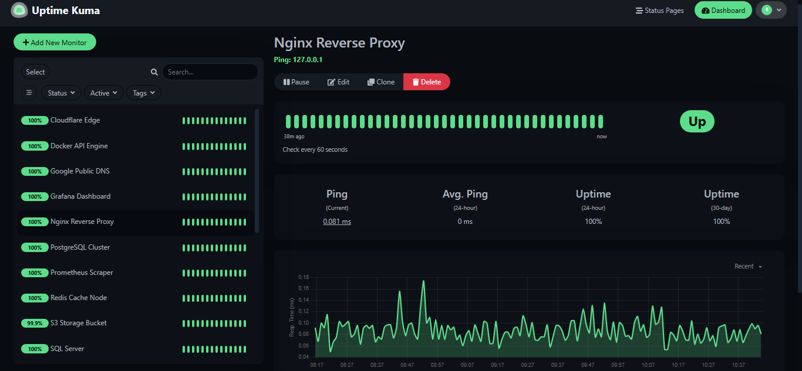

# 🛠️ Uptime Kuma Implementation

This project demonstrates a real-time monitoring dashboard for infrastructure services.

## 🚀 Concept
Instead of manual checks, I implemented Uptime Kuma to provide a **proactive observability layer**.

## 📸 Monitoring Preview

---
*Created by Thiago Monaco Caminha*
